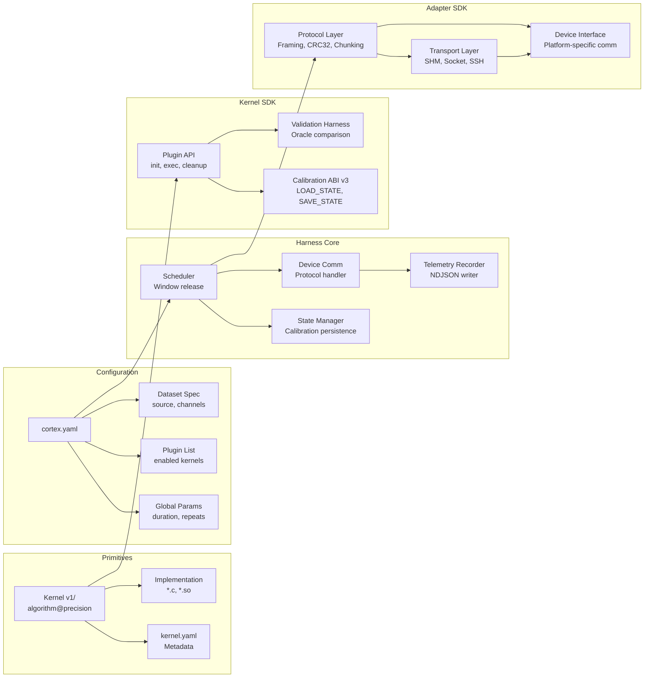
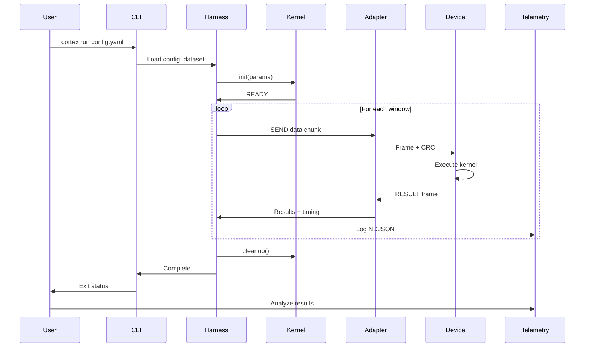
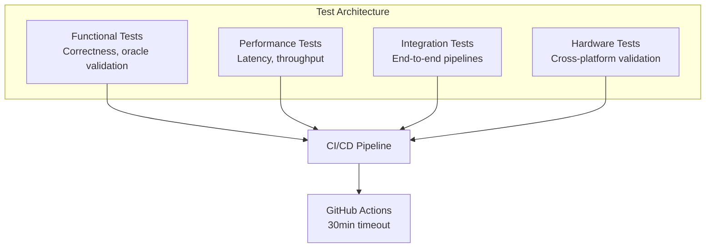

# CORTEX Architecture Diagram

## High-Level Architecture (Mermaid)

```mermaid
graph TB
    subgraph "User Layer"
        AR[Algorithm Researcher<br/>Python/MATLAB]
        SE[Software Engineer<br/>C/C++]
        HE[Hardware Engineer<br/>Verilog/RTL]
    end

    subgraph "CORTEX CLI"
        CLI[cortex CLI<br/>run | calibrate | validate | generate]
    end

    subgraph "Primitives Layer"
        K[Kernels<br/>bandpass_fir, car, csp, ica, etc.]
        C[Configs<br/>cortex.yaml]
        D[Datasets<br/>EEG/synthetic]
    end

    subgraph "Orchestration Layer"
        H[Harness<br/>Scheduler, State Management]
        O[Oracle Validator<br/>rtol=1e-5]
        T[Telemetry<br/>NDJSON logging]
    end

    subgraph "SDK Layer"
        KS[Kernel SDK<br/>Plugin API, Calibration ABI]
        AS[Adapter SDK<br/>Transport, Protocol, Device Comm]
    end

    subgraph "Device Adapter Layer"
        DA1[x86 Loopback]
        DA2[ARM/Jetson]
        DA3[RPi SSH]
        DA4[Custom HW]
    end

    subgraph "Platform Layer"
        P1[x86 Linux/macOS]
        P2[ARM Jetson]
        P3[Raspberry Pi]
        P4[FPGA/ASIC Future]
    end

    subgraph "Analysis Layer"
        A[Python Analysis Tools<br/>Latency, CDF, DVFS]
    end

    AR --> CLI
    SE --> CLI
    HE --> CLI

    CLI --> K
    CLI --> C
    CLI --> D

    K --> H
    C --> H
    D --> H

    H --> O
    H --> T
    H --> KS
    H --> AS

    KS --> K
    AS --> DA1
    AS --> DA2
    AS --> DA3
    AS --> DA4

    DA1 --> P1
    DA2 --> P2
    DA3 --> P3
    DA4 --> P4

    T --> A

    style AR fill:#e1f5ff
    style SE fill:#e1f5ff
    style HE fill:#e1f5ff
    style H fill:#fff4e1
    style O fill:#ffe1e1
    style KS fill:#e1ffe1
    style AS fill:#e1ffe1
```

## Detailed Component Architecture



## Data Flow Architecture



## Layer Responsibilities

### 1. User Layer
- **Algorithm Researcher**: Python/MATLAB prototypes
- **Software Engineer**: C/C++ optimization
- **Hardware Engineer**: RTL design (future)

### 2. CLI Layer
- Commands: `run`, `calibrate`, `validate`, `generate`
- Configuration parsing
- Error handling and reporting

### 3. Primitives Layer
- **Kernels**: Versioned, validated algorithms
- **Configs**: YAML specs for experiments
- **Datasets**: EEG data or synthetic generation

### 4. Orchestration Layer
- **Harness**: Schedule windows, manage execution
- **Oracle Validator**: Numerical correctness (rtol=1e-5)
- **Telemetry**: NDJSON logging for analysis

### 5. SDK Layer
- **Kernel SDK**: Plugin API, calibration ABI
- **Adapter SDK**: Transport abstraction, protocol handling

### 6. Device Adapter Layer
- **Loopback**: Local in-process testing
- **SSH**: Remote embedded deployment
- **Platform-specific**: Custom hardware integration

### 7. Platform Layer
- **x86**: Linux/macOS development
- **ARM**: Jetson, Raspberry Pi
- **FPGA/ASIC**: Future custom hardware

### 8. Analysis Layer
- Python tools for latency, CDF, DVFS analysis
- Visualization and statistical reporting

## Cross-Cutting Concerns

### Oracle Validation
```
Reference Implementation (Python/MATLAB)
           ↓
    Generate test vectors
           ↓
    CORTEX Kernel (C)
           ↓
    Compare outputs (rtol=1e-5)
           ↓
    PASS/FAIL + detailed diff
```

### Calibration Workflow (Trainable Kernels)
```
cortex calibrate config.yaml
           ↓
    Offline computation (ICA/CSP)
           ↓
    SAVE_STATE frame → file
           ↓
cortex run config.yaml
           ↓
    LOAD_STATE from file
           ↓
    Execute with calibrated params
```

### Device Adapter Auto-Deploy
```
Local Build
     ↓
SSH Copy → Remote Platform
     ↓
Remote Execute via Adapter
     ↓
Stream Results via Protocol
     ↓
Local Analysis
```

## Test Infrastructure (4 Pillars)



## File Organization

```
CORTEX/
├── primitives/
│   ├── kernels/v1/{algorithm}@{precision}/
│   │   ├── kernel.yaml
│   │   ├── {algorithm}.c
│   │   └── scripts/validate.py
│   ├── configs/cortex.yaml
│   └── adapters/v1/{arch}@{transport}/
├── sdk/
│   ├── kernel/          # Plugin API
│   └── adapter/         # Protocol + Transport
├── src/
│   ├── engine/harness/  # Orchestrator
│   └── cortex/          # Python CLI
├── tests/
│   ├── functional/
│   ├── performance/
│   ├── integration/
│   └── hardware/
└── docs/
    └── validation/      # Empirical studies
```

## Key Design Principles

1. **Separation of Concerns**: Primitives ≠ Execution
2. **Platform Abstraction**: Device adapters hide hardware
3. **Oracle Validation**: Correctness first, speed second
4. **Versioning**: Explicit kernel/adapter/ABI versions
5. **Reproducibility**: Config + dataset + kernel → deterministic results
6. **Telemetry**: Rich NDJSON logging for offline analysis

## Protocol Stack (RESULT Frame Chunking)

```
Application Layer:    [CORTEX Kernel Results]
                             ↓
Framing Layer:        [RESULT_CHUNK frames (8KB)]
                             ↓
Integrity Layer:      [CRC32 checksums]
                             ↓
Transport Layer:      [SHM | Socket | SSH]
                             ↓
Platform Layer:       [Linux | macOS | Embedded]
```

## Performance Characterization Pipeline

```
CORTEX run → Telemetry NDJSON
                ↓
        Python Analysis
                ↓
    ┌───────────┴───────────┐
    ↓                       ↓
Latency Distribution    DVFS Impact
  (CDF, P99)           (Idle Paradox)
    ↓                       ↓
Cross-Platform         Governor
 Comparison           Comparison
```
