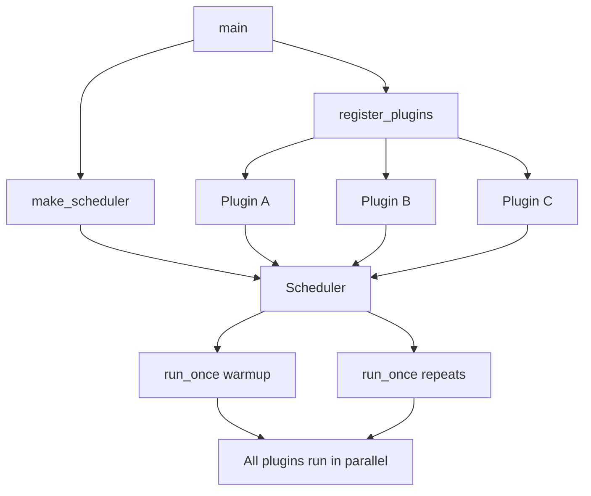
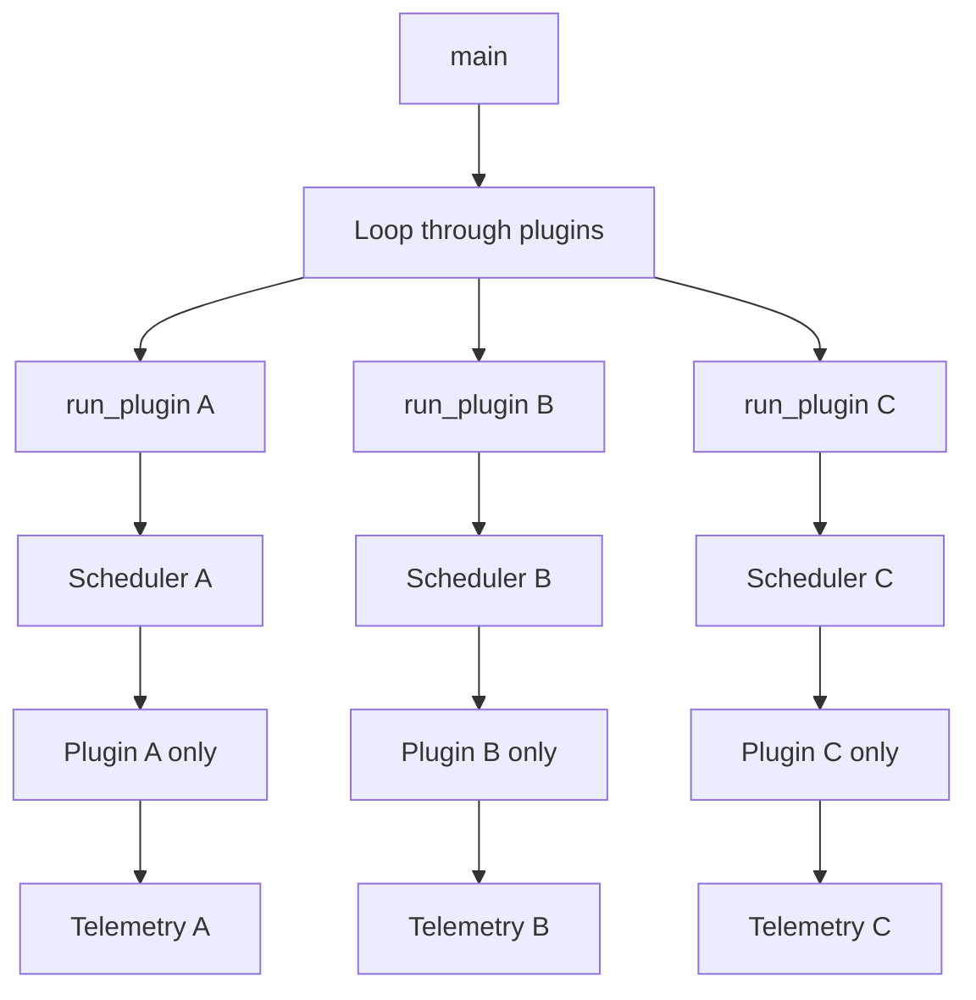

# Sequential Plugin Execution

## Overview

This document describes the implementation of sequential plugin execution in the CORTEX harness, replacing the previous parallel execution model. This change aligns with the architectural requirements specified in `HARNESS_ARCHITECTURE_CHANGES.md` Phase 1.

## Architectural Decision: Why Sequential vs Parallel Execution

### Measurement Isolation Requirements

**Problem**: Parallel execution of multiple plugins caused resource contention:
- CPU cores competed for processing time
- Memory bandwidth was shared between plugins
- Cache lines were invalidated by competing plugins
- This led to inaccurate and non-reproducible performance measurements

**Solution**: Sequential execution ensures each plugin runs with full system resources:
- Each plugin gets dedicated CPU time
- Memory bandwidth is not shared
- Cache state is consistent for each plugin
- Measurements are isolated and reproducible

### CPU/Memory/Cache Contention Elimination

**Before (Parallel)**:
```
Plugin A ──┐
Plugin B ──┼── Scheduler ── CPU/Memory (contention)
Plugin C ──┘
```

**After (Sequential)**:
```
Plugin A ── Scheduler A ── CPU/Memory (isolated)
Plugin B ── Scheduler B ── CPU/Memory (isolated)  
Plugin C ── Scheduler C ── CPU/Memory (isolated)
```

### HIL Compatibility

Sequential execution matches the future Hardware-in-the-Loop (HIL) execution model where:
- Each plugin will run on dedicated hardware
- No resource sharing between plugins
- Clean isolation for accurate measurements
- Easier debugging and fault isolation

### Reproducibility Benefits

- **Consistent warmup**: Each plugin gets identical warmup treatment
- **Predictable timing**: No interference from other plugins
- **Stable measurements**: Results are reproducible across runs
- **Better debugging**: Issues are isolated to specific plugins

## Implementation Details

### Plugin Orchestration through `run_plugin()`

The `run_plugin()` function orchestrates the complete execution of a single plugin:

```c
static int run_plugin(harness_context_t *ctx, size_t plugin_idx) {
    // 1. Get plugin configuration
    // 2. Build per-plugin telemetry path
    // 3. Create scheduler with plugin-specific W/H/C/dtype
    // 4. Load and register plugin
    // 5. Configure telemetry buffer
    // 6. Run warmup phase
    // 7. Run measurement repeats
    // 8. Cleanup (unload plugin, destroy scheduler)
    // 9. Write telemetry to CSV
    // 10. Reset buffer for next plugin
}
```

### Scheduler Lifecycle per Plugin

Each plugin gets its own scheduler instance:

1. **Creation**: `make_scheduler()` creates scheduler with plugin-specific configuration
2. **Configuration**: Telemetry buffer, run ID, and repeat tracking are set
3. **Plugin Registration**: Single plugin is loaded and registered
4. **Execution**: Warmup + measurement repeats
5. **Cleanup**: Plugin unloaded, scheduler destroyed

### Telemetry Buffer Flow: Scheduler → Buffer → CSV

**Data Flow**:
```
Scheduler.record_window_metrics() 
    ↓
cortex_telemetry_add(buffer, record)
    ↓
cortex_telemetry_write_csv(file, buffer)
```

**Per-Plugin Files**:
- Format: `<output_dir>/<run_id>_<plugin_name>_telemetry.csv`
- Example: `results/run_abc123_car_telemetry.csv`
- Example: `results/run_abc123_notch_iir_telemetry.csv`

### Repeat Tracking Mechanism

- **Warmup**: `current_repeat = 0`
- **Measurement**: `current_repeat = 1, 2, 3, ...` (per repeat)
- **Telemetry Records**: Include repeat number for analysis
- **Buffer Reset**: After each plugin completes

## Usage Guidelines

### Configuring Plugins for Sequential Runs

No configuration changes required - existing YAML configs work unchanged:

```yaml
plugins:
  - name: car
    status: ready
    runtime:
      window_length_samples: 1024
      hop_samples: 512
      channels: 1
      dtype: 1  # float32
  - name: notch_iir  
    status: ready
    runtime:
      window_length_samples: 2048  # Different from car
      hop_samples: 1024
      channels: 1
      dtype: 1
```

### Expected Runtime Increases

**Before**: `Total Time = max(plugin_times)`
**After**: `Total Time = sum(plugin_times)`

Example:
- Plugin A: 10 seconds
- Plugin B: 15 seconds  
- Plugin C: 8 seconds

- **Parallel**: ~15 seconds (longest plugin)
- **Sequential**: ~33 seconds (sum of all plugins)

### Interpreting Per-Plugin Telemetry Files

Each plugin generates its own telemetry file with complete isolation:

```csv
run_id,plugin_name,window_index,release_ts_ns,deadline_ts_ns,start_ts_ns,end_ts_ns,deadline_missed,W,H,C,Fs,warmup,repeat
abc123,car,0,1000000,2000000,1001000,1002000,0,1024,512,1,48000,1,0
abc123,car,1,2000000,3000000,2001000,2002000,0,1024,512,1,48000,0,1
```

**Analysis Benefits**:
- Compare plugins directly (same run conditions)
- Identify performance bottlenecks per plugin
- Validate measurement consistency
- Debug plugin-specific issues

## Comparison: Before/After Architecture

### Before (Parallel Execution)



**Issues**:
- Resource contention
- Non-reproducible measurements
- Complex debugging
- HIL incompatibility

### After (Sequential Execution)



**Benefits**:
- Clean isolation
- Reproducible measurements
- Easy debugging
- HIL ready

## References

- [HARNESS_ARCHITECTURE_CHANGES.md](../HARNESS_ARCHITECTURE_CHANGES.md) - Phase 1 rationale
- [PLUGIN_INTERFACE.md](PLUGIN_INTERFACE.md) - Plugin ABI specification
- [RUN_CONFIG.md](RUN_CONFIG.md) - Configuration schema

## Implementation Status

✅ **Completed**:
- Sequential plugin execution
- Per-plugin scheduler instances
- Telemetry buffer integration
- Heterogeneous plugin shapes support
- Proper plugin cleanup

🔄 **Future Enhancements**:
- Error handling with `fail_fast` option
- JSON telemetry output format
- Enhanced debugging tools
